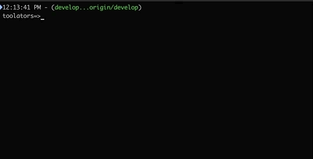
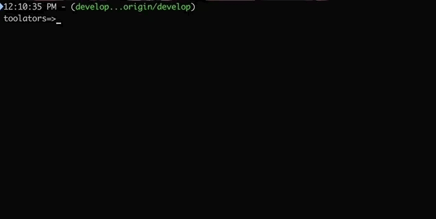

# Github Command Lines in Golang

  

## git-latest

The tool gets the latest version in as tag if not found 0.0.0.

## incrementor

The tool increments the verson.

## associator

The tool associates the binary to a release in github.

## d-day

The tool caculates how many days before the d-day.

## soap

The tool soap calls a service soap.

## notifier

The tool sends a message in your messaging.

## aws-cloudformation-status

The tool gets the stack status.

## catfile

The tool cat in file (gif, png, ...).

